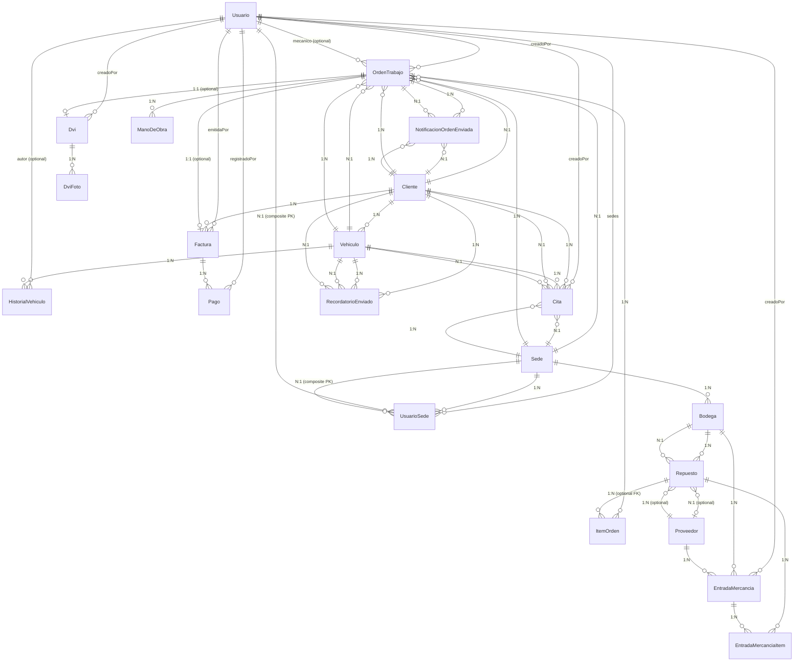
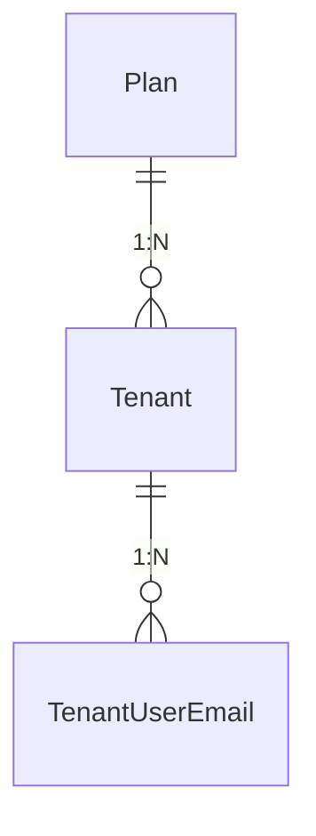

# TorqueFlow Database Schema — Reference for Seed Script Authors

## 1. Overview

TorqueFlow is a multi-tenant SaaS for auto repair shops ("talleres"), built with Next.js (App Router), Prisma ORM, PostgreSQL, and Zod for input validation. Multi-tenancy is implemented as **one PostgreSQL schema per tenant** inside a single database: a `public` control-plane schema holds the tenant registry (`Tenant`, `Plan`, `TenantUserEmail`, `SuperAdmin`), and every tenant's business data (clients, vehicles, work orders, inventory, invoices, etc.) lives in its own dedicated Postgres schema, all sharing one identical table structure defined by a second, separate Prisma schema (`prisma/tenant/schema.prisma`). A login is resolved to its tenant **by email** (via `TenantUserEmail`, a public-schema table), not by subdomain — this replaced an earlier subdomain-based design (Fase 10, 2026-08-25).

This document exists so that another AI, with no other access to this repository, can write a correct seed script (for either the public schema or a tenant schema) purely from what is written here — the real Prisma models, the real Zod validation rules, the real enum values, and the real business-rule constraints, all sourced verbatim from the current codebase.

## 2. Multi-tenant structure

### Public (control-plane) schema — `prisma/schema.prisma`

- `datasource db { provider = "postgresql", url = env("DATABASE_URL") }` — a normal single-schema Postgres connection (the `public` Postgres schema), generated into `../src/generated/prisma-public`.
- **`Tenant`** — one row per taller. Key fields: `slug` (unique, internal identifier — no longer DNS-related since Fase 10), `schemaName` (unique — the literal name of that tenant's dedicated Postgres schema), `estado` (`EstadoTenant`: `ACTIVO` | `SUSPENDIDO`), `planId` → `Plan`.
- **`Plan`** — the 3 fixed subscription tiers (`Básico`, `Estándar`, `Avanzado` per the design doc, though the schema does not hardcode these names — they're just rows with a unique `nombre`). Fields: `precio` (optional `Decimal(10,2)`), `maxUsuarios` (optional `Int`), `maxSedes` (optional `Int` — this is the hard limit on how many `Sede` rows a tenant may have; enforced server-side, not just hidden in the UI).
- **`TenantUserEmail`** — the global email → tenant index. PK is the literal `email` string (not a generated id), FK `tenantId` → `Tenant`. This exists because `Usuario.email` in the tenant schema is only unique *within* that one tenant's schema; login needs a global lookup to know which tenant schema to even open. Every `Usuario` create/update/delete in a tenant schema **must** have a matching row here (via `claimTenantUserEmail`/`releaseTenantUserEmail`, `src/lib/tenant/tenant-user-email.ts`) or that user cannot log in at all.
- **`SuperAdmin`** — the platform operator's own login (not tied to any tenant): `email` (unique), `passwordHash`, `nombre`.

### Tenant schema — `prisma/tenant/schema.prisma`

- `datasource db { provider = "postgresql", url = env("TENANT_DATABASE_URL") }` — generated into `../../src/generated/prisma-tenant`. This is **not** Prisma's native `schemas = [...]` multi-schema-in-one-datasource feature; it is one identical schema definition applied N times to N different Postgres schemas (one per tenant), each via its own `TENANT_DATABASE_URL` / dynamically-built connection string.
- Tenant schema selection happens by appending a `?schema=<schemaName>` query parameter (and `&connection_limit=N`) to a shared base Postgres connection string at **runtime**, per request — see `buildTenantConnectionString()` in `src/lib/db/tenant-client.ts`. `getTenantDb(schemaName: string)` returns a cached `PrismaClient` (an LRU cache capped at `MAX_CACHED_TENANT_CLIENTS = 20`, evicting the least-recently-used client and disconnecting it) constructed with `new TenantPrismaClient({ datasourceUrl: buildTenantConnectionString(schemaName) })`.
- To provision a brand-new tenant schema, `scripts/provision-tenant.ts` runs `npx prisma migrate deploy --schema=prisma/tenant/schema.prisma` with `TENANT_DATABASE_URL` pointed at `<base>?schema=<newSchemaName>`, which creates all tenant tables inside that one named Postgres schema (it also runs `CREATE SCHEMA IF NOT EXISTS "<schemaName>"` first). **A seed script targeting a tenant must connect the same way**: either reuse `getTenantDb(schemaName)`, or build its own Prisma client with a `datasourceUrl` ending in `?schema=<schemaName>`.

### Dev-tenant / seed-admin values found in the repo

- **No hardcoded "dev tenant" (e.g. a `taller-dev` slug or `admin@dev.test` login) exists anywhere in the repository.** `scripts/seed-tenant-user.ts` and `scripts/cli/seed-tenant-user.ts` are generic CLI tools (`npm run tenant:seed-user -- <schemaName> <email> <password> <nombre> [role]`) that take all values as arguments — they contain no baked-in tenant/user values. `scripts/seed-super-admin.ts` / `scripts/cli/seed-super-admin.ts` are the same pattern for `SuperAdmin`.
- **`.env.example`** only shows a placeholder reference schema name, `taller_dev_reference`, used purely as an example `TENANT_DATABASE_URL` value for authoring/replaying migrations locally — it is not a tenant that the app creates or expects to exist, and no credentials are attached to it.
- **The only concrete, real seeded values in the repo** are the **E2E smoke-test fixture** in `e2e/global-setup.ts` (used only by the Playwright e2e suite, torn down/recreated per run, not a persistent dev environment):
  - `E2E_SLUG = "taller-e2e-smoke"`, `E2E_SCHEMA = "taller_e2e_smoke"`
  - `E2E_ADMIN_EMAIL = "admin@e2e-smoke.test"`, `E2E_ADMIN_PASSWORD = "SmokeTest123!"` (role `ADMIN`, nombre `"Admin E2E"`)
  - `E2E_TECNICO_EMAIL = "tecnico@e2e-smoke.test"`, `E2E_TECNICO_PASSWORD = "SmokeTest123!"` (role `TECNICO`, nombre `"Tec E2E"`)
  - `E2E_RECEPCION_EMAIL = "recepcion@e2e-smoke.test"`, `E2E_RECEPCION_PASSWORD = "SmokeTest123!"` (role `RECEPCION`, nombre `"Recep E2E"`)
  - This fixture calls `provisionTenant()` (which defaults every new tenant to the **`Básico`** plan by looking it up with `publicDb.plan.findUniqueOrThrow({ where: { nombre: "Básico" } })`), then explicitly upgrades the tenant to the **`Avanzado`** plan (looked up the same way) because the e2e suite needs multi-sede behavior.
  - **Important gap for a seed-script author**: `provisionTenant()` assumes `Plan` rows named `"Básico"` and `"Avanzado"` (and, by the design doc's tier list, `"Estándar"`) **already exist** in the public schema — nothing in the application code creates `Plan` rows (no `plan.create`/`upsert`/`createMany` call exists anywhere in `src/` or `scripts/`, confirmed by search). **A seed script must create the three `Plan` rows itself before provisioning any tenant**, or `provisionTenant()`/e2e setup will throw `findUniqueOrThrow` errors.
  - `provisionTenant()` itself always creates one `Sede` named `"Sede principal"` and one `Bodega` named `"Bodega principal"` (linked to that sede) automatically for every newly-provisioned tenant, before any seed script runs.
- Treat all of the above as illustrative facts about existing fixtures/behavior, not as values to copy into a "real" seed — do not invent additional dev-tenant credentials beyond what is listed here.

## 3. Entity-relationship diagram

### Tenant schema



`ConfiguracionSmtp` has no relations — it is a tenant-wide singleton row (fixed `id = "singleton"`, DB-level CHECK constraint enforcing at most one row).

### Public / control-plane schema



`SuperAdmin` is standalone (no FK relations to `Tenant`/`Plan`). A `Tenant.schemaName` names a Postgres schema that contains an entire independent copy of every model in section "Tenant schema" above — that relationship is structural (schema-per-tenant), not a Prisma-level foreign key.

## 4. Per-model reference

Public-schema models first (no cross-schema FKs into the tenant schema exist — the link is purely `schemaName` as a string). Tenant-schema models follow in dependency order (models with no FK dependencies first).

### Public schema

#### `Plan` (table `planes`)

| Field | Type | Nullable | Default | Unique | Notes |
|---|---|---|---|---|---|
| id | String (cuid) | No | `cuid()` | PK | |
| nombre | String | No | — | Yes | e.g. `"Básico"`, `"Estándar"`, `"Avanzado"` per design doc — not enforced by an enum, just unique text |
| precio | Decimal? | Yes | — | No | `@db.Decimal(10,2)` — reference price only, no billing enforcement in v1 |
| maxUsuarios | Int? | Yes | — | No | mapped `max_usuarios`; null = no cap |
| maxSedes | Int? | Yes | — | No | mapped `max_sedes`; hard cap on `Sede` rows per tenant, enforced server-side |
| createdAt | DateTime | No | `now()` | No | |
| updatedAt | DateTime | No | auto (`@updatedAt`) | No | |

Relations: `tenants Tenant[]` (1:N, `Tenant.planId` → `Plan.id`).

Zod validation: none found — `Plan` rows are not created through a user-facing form/action in this codebase; they must be created directly (e.g. by a seed script) since no `plan.create`/`upsert` call exists anywhere in the app code.

#### `Tenant` (table `tenants`)

| Field | Type | Nullable | Default | Unique | Notes |
|---|---|---|---|---|---|
| id | String (cuid) | No | `cuid()` | PK | |
| slug | String | No | — | Yes | internal identifier only since Fase 10 (no longer a DNS label) |
| schemaName | String | No | — | Yes | mapped `schema_name`; literal Postgres schema name for this tenant |
| estado | EstadoTenant | No | `ACTIVO` | No | enum: `ACTIVO`, `SUSPENDIDO` |
| planId | String | No | — | No (indexed) | FK → `Plan.id`, `onDelete: Restrict` |
| createdAt | DateTime | No | `now()` | No | |
| updatedAt | DateTime | No | auto | No | |

Relations: `plan Plan` (N:1, Restrict), `userEmails TenantUserEmail[]` (1:N).

Zod validation: none found for `Tenant` creation directly; `scripts/provision-tenant.ts` validates `slug` via `isValidTenantSlug()` (format-only since Fase 10 — no longer checks DNS-reserved words) and `schemaName` via the regex `/^[a-z][a-z0-9_]*$/` (lowercase snake_case, must start with a letter).

#### `TenantUserEmail` (table `tenant_user_emails`)

| Field | Type | Nullable | Default | Unique | Notes |
|---|---|---|---|---|---|
| email | String | No | — | PK | literal email string as primary key, globally unique across ALL tenants |
| tenantId | String | No | — | No (indexed) | FK → `Tenant.id`, `onDelete: Cascade` |
| createdAt | DateTime | No | `now()` | No | |

Relations: `tenant Tenant` (N:1, Cascade).

Business rule: populated exclusively via `claimTenantUserEmail`/`releaseTenantUserEmail` (`src/lib/tenant/tenant-user-email.ts`) — `claimTenantUserEmail` throws `TenantUserEmailConflictError` rather than overwriting an email already claimed by a *different* tenant. A seed script creating tenant `Usuario` rows must insert a matching `TenantUserEmail` row too, or that user can never log in.

#### `SuperAdmin` (table `super_admins`)

| Field | Type | Nullable | Default | Unique | Notes |
|---|---|---|---|---|---|
| id | String (cuid) | No | `cuid()` | PK | |
| email | String | No | — | Yes | |
| passwordHash | String | No | — | No | mapped `password_hash`; bcrypt hash, cost factor 12 (`bcrypt.hash(password, 12)` in `scripts/seed-super-admin.ts`) |
| nombre | String | No | — | No | |
| createdAt | DateTime | No | `now()` | No | |
| updatedAt | DateTime | No | auto | No | |

No relations. No Zod schema found (created only via the CLI seed script / super-admin UI actions, not researched further here as it's out of scope of the tenant business schema).

### Tenant schema

Dependency order: `Usuario`, `Cliente`, `Sede` have no FK dependencies and come first; `Vehiculo` depends on `Cliente`; `UsuarioSede` depends on `Usuario`+`Sede`; `Bodega` depends on `Sede`; `Proveedor` has no dependency; `Repuesto` depends on `Bodega`(+`Proveedor` optional); `OrdenTrabajo` depends on `Cliente`+`Vehiculo`+`Sede`+`Usuario`; `ItemOrden`/`ManoDeObra`/`Dvi` depend on `OrdenTrabajo`; `DviFoto` depends on `Dvi`; `EntradaMercancia` depends on `Proveedor`+`Bodega`+`Usuario`; `EntradaMercanciaItem` depends on `EntradaMercancia`+`Repuesto`; `Factura` depends on `OrdenTrabajo`+`Cliente`+`Usuario`; `Pago` depends on `Factura`+`Usuario`; `Cita` depends on `Cliente`+`Vehiculo`+`Sede`+`Usuario`; `HistorialVehiculo` depends on `Vehiculo`(+`Usuario` optional); `RecordatorioEnviado` depends on `Vehiculo`+`Cliente`; `NotificacionOrdenEnviada` depends on `OrdenTrabajo`+`Cliente`; `ConfiguracionSmtp` has no dependency (singleton).

#### `Usuario` (table `usuarios`)

| Field | Type | Nullable | Default | Unique | Notes |
|---|---|---|---|---|---|
| id | String (cuid) | No | `cuid()` | PK | |
| email | String | No | — | Yes | globally unique via `TenantUserEmail`, but the DB-level unique constraint here is only per-schema |
| passwordHash | String | No | — | No | mapped `password_hash`; bcrypt, cost 12 |
| nombre | String | No | — | No | |
| role | Role | No | `RECEPCION` | No | enum: `ADMIN`, `TECNICO`, `RECEPCION` |
| createdAt | DateTime | No | `now()` | No | |
| updatedAt | DateTime | No | auto | No | |

Relations (all reverse 1:N from `Usuario`): `historialEntries HistorialVehiculo[]` (optional FK `autorId`, `SetNull`), `ordenesCreadas OrdenTrabajo[]` (relation `OrdenCreadoPor`, required FK, `Restrict`), `ordenesAsignadas OrdenTrabajo[]` (relation `OrdenMecanico`, optional FK `mecanicoId`, `SetNull`), `dviRealizados Dvi[]` (required FK, `Restrict`), `entradasCreadas EntradaMercancia[]` (required FK, `Restrict`), `facturasEmitidas Factura[]` (required FK, `Restrict`), `pagosRegistrados Pago[]` (required FK, `Restrict`), `citasCreadas Cita[]` (relation `CitaCreadoPor`, required FK, `Restrict`), `sedes UsuarioSede[]` (bridge table, `Cascade`).

Zod validation (`usuario.ts`):
- Create (`usuarioCreateInputSchema`): `nombre` required non-empty string; `email` required valid email; `password` required, min 8 chars; `role` required enum (`ADMIN`|`TECNICO`|`RECEPCION`).
- Update (`usuarioUpdateInputSchema`): same, except `password` is **optional** (blank string = "keep the existing password" — same convention as `ConfiguracionSmtp.password`).
- Business rule (not Zod, but enforced at the auth layer): a `TECNICO`/`RECEPCION` user with **zero** `UsuarioSede` rows cannot pass the login sede gate at all (`src/lib/validation/sede.ts`'s `usuarioSedesInputSchema` requires at least one sede id when assigning via the UI). `seedTenantUser()` always grants the newly-created user the tenant's oldest `Sede` (by `createdAt asc`) automatically. `ADMIN` bypasses the sede-membership check entirely (sees all sedes) but still commonly gets a `UsuarioSede` row for consistency in `/usuarios`.

#### `Cliente` (table `clientes`) — tenant-wide, NOT sede-scoped

| Field | Type | Nullable | Default | Unique | Notes |
|---|---|---|---|---|---|
| id | String (cuid) | No | `cuid()` | PK | |
| nombre | String | No | — | No | |
| telefono | String? | Yes | — | No | |
| email | String? | Yes | — | No | |
| documento | String? | Yes | — | No | |
| createdAt | DateTime | No | `now()` | No | |
| updatedAt | DateTime | No | auto | No | |

Relations: `vehiculos Vehiculo[]` (1:N, `Restrict`), `ordenes OrdenTrabajo[]` (1:N, `Restrict`), `facturas Factura[]` (1:N, `Restrict`), `citas Cita[]` (1:N, `Restrict`), `recordatorios RecordatorioEnviado[]` (1:N, `Cascade`), `notificacionesOrden NotificacionOrdenEnviada[]` (1:N, `Cascade`).

Zod validation (`cliente.ts`, `clienteInputSchema`): `nombre` required non-empty; `telefono` optional (tolerates `""`); `email` optional valid-email-or-`""`; `documento` optional (tolerates `""`). Note: the DB allows `telefono`/`email`/`documento` to be `null`, but form submission via the tolerant `""` pattern means the app effectively stores `""` rather than `null` for untouched optional text fields in most flows — a seed script may use either `null` or `""` for realism, but be aware forms never produce a Prisma-level `undefined`.

#### `Sede` (table `sedes`) — sede-scoped (is itself the scope unit)

| Field | Type | Nullable | Default | Unique | Notes |
|---|---|---|---|---|---|
| id | String (cuid) | No | `cuid()` | PK | |
| nombre | String | No | — | No | |
| direccion | String? | Yes | — | No | |
| createdAt | DateTime | No | `now()` | No | |
| updatedAt | DateTime | No | auto | No | |

Relations: `ordenes OrdenTrabajo[]` (1:N, `Restrict`), `bodegas Bodega[]` (1:N, `Restrict`), `usuarios UsuarioSede[]` (1:N, `Restrict`), `citas Cita[]` (1:N, `Restrict`).

Zod validation (`sede.ts`, `sedeInputSchema`): `nombre` required non-empty; `direccion` optional (tolerates `""`).

Business rule: `Plan.maxSedes` caps how many `Sede` rows a tenant may create — enforced server-side (see `src/lib/planes/limites.test.ts`, not read in full here but referenced by the design doc §9). `provisionTenant()` always creates a first `Sede` named `"Sede principal"` for every new tenant.

#### `Vehiculo` (table `vehiculos`) — tenant-wide, NOT sede-scoped

| Field | Type | Nullable | Default | Unique | Notes |
|---|---|---|---|---|---|
| id | String (cuid) | No | `cuid()` | PK | |
| placa | String | No | — | Yes | license plate |
| marca | String | No | — | No | make |
| modelo | String | No | — | No | model |
| anio | Int? | Yes | — | No | year |
| combustible | TipoCombustible? | Yes | — | No | enum: `GASOLINA`, `DIESEL`, `HIBRIDO`, `ELECTRICO` |
| kilometraje | Int? | Yes | — | No | odometer |
| proximoMantenimiento | DateTime? | Yes | — | No | mapped `proximo_mantenimiento` |
| transmision | TipoTransmision? | Yes | — | No | enum: `AUTOMATICA`, `MECANICA` |
| observaciones | String? | Yes | — | No | |
| clienteId | String | No | — | No (indexed) | FK → `Cliente.id`, `Restrict` |
| createdAt | DateTime | No | `now()` | No | |
| updatedAt | DateTime | No | auto | No | |

Relations: `cliente Cliente` (N:1, Restrict), `historial HistorialVehiculo[]` (1:N, Restrict), `ordenes OrdenTrabajo[]` (1:N, Restrict), `citas Cita[]` (1:N, Restrict), `recordatorios RecordatorioEnviado[]` (1:N, Cascade).

Zod validation (`vehiculo.ts`, `vehiculoInputSchema`): `placa` required non-empty; `marca` required non-empty; `modelo` required non-empty; `anio` optional coerced int, min 1900, max 2100; `combustible` optional enum; `kilometraje` optional coerced int, min 0; `proximoMantenimiento` optional coerced date; `transmision` optional enum; `observaciones` optional string. Note the DB allows `anio`/`combustible`/`kilometraje`/`proximoMantenimiento`/`transmision`/`observaciones` to be fully absent (`null`) — the Zod schema mirrors this (all optional), so a seed script is free to omit them for some vehicles.

#### `UsuarioSede` (table `usuario_sedes`) — bridge table, composite PK

| Field | Type | Nullable | Default | Unique | Notes |
|---|---|---|---|---|---|
| usuarioId | String | No | — | part of composite PK | FK → `Usuario.id`, `Cascade` |
| sedeId | String | No | — | part of composite PK (indexed) | FK → `Sede.id`, `Restrict` |
| createdAt | DateTime | No | `now()` | No | |

`@@id([usuarioId, sedeId])` — the same usuario/sede pair can never be duplicated; no surrogate id.

Zod validation (`sede.ts`, `usuarioSedesInputSchema`): `sedeIds` array, min length 1 (each element a non-empty string) — "at least one sede is mandatory" business rule described above.

#### `Bodega` (table `bodegas`) — sede-scoped (`sedeId` required, indexed)

| Field | Type | Nullable | Default | Unique | Notes |
|---|---|---|---|---|---|
| id | String (cuid) | No | `cuid()` | PK | |
| nombre | String | No | — | No | |
| sedeId | String | No | — | No (indexed) | FK → `Sede.id`, `Restrict` |
| createdAt | DateTime | No | `now()` | No | |
| updatedAt | DateTime | No | auto | No | |

Relations: `sede Sede` (N:1, Restrict), `repuestos Repuesto[]` (1:N, Restrict), `entradas EntradaMercancia[]` (1:N, Restrict).

Zod validation (`inventario.ts`, `bodegaInputSchema`): `nombre` required non-empty. `sedeId` is not part of the form schema (assigned by the calling action from context).

#### `Proveedor` (table `proveedores`) — tenant-wide

| Field | Type | Nullable | Default | Unique | Notes |
|---|---|---|---|---|---|
| id | String (cuid) | No | `cuid()` | PK | |
| nombre | String | No | — | No | |
| contacto | String? | Yes | — | No | |
| telefono | String? | Yes | — | No | |
| email | String? | Yes | — | No | |
| createdAt | DateTime | No | `now()` | No | |
| updatedAt | DateTime | No | auto | No | |

Relations: `repuestos Repuesto[]` (1:N, optional FK, `SetNull`), `entradas EntradaMercancia[]` (1:N, required FK, `Restrict`).

Zod validation (`inventario.ts`, `proveedorInputSchema`): `nombre` required non-empty; `contacto` optional (tolerates `""`); `telefono` optional (tolerates `""`); `email` optional valid-email-or-`""`.

#### `Repuesto` (table `repuestos`) — inherits sede scope through `Bodega` (`scopeRepuesto` = `{ bodega: { sedeId } }`)

| Field | Type | Nullable | Default | Unique | Notes |
|---|---|---|---|---|---|
| id | String (cuid) | No | `cuid()` | PK | |
| codigo | String | No | — | Yes | SKU/part code |
| nombre | String | No | — | No | |
| descripcion | String? | Yes | — | No | |
| precioCompra | Decimal | No | — | No | mapped `precio_compra`, `@db.Decimal(10,2)` |
| precioVenta | Decimal | No | — | No | mapped `precio_venta`, `@db.Decimal(10,2)` |
| stockActual | Int | No | `0` | No | mapped `stock_actual` |
| stockMinimo | Int | No | `0` | No | mapped `stock_minimo` — reorder alert threshold |
| bodegaId | String | No | — | No (indexed) | FK → `Bodega.id`, `Restrict` |
| proveedorId | String? | Yes | — | No (indexed) | FK → `Proveedor.id`, `SetNull` |
| createdAt | DateTime | No | `now()` | No | |
| updatedAt | DateTime | No | auto | No | |

Relations: `bodega Bodega` (N:1, Restrict), `proveedor Proveedor?` (N:1, SetNull), `entradaItems EntradaMercanciaItem[]` (1:N), `itemsOrden ItemOrden[]` (1:N, optional FK on the child side).

Zod validation (`inventario.ts`, `repuestoInputSchema`): `codigo` required non-empty; `nombre` required non-empty; `descripcion` optional (tolerates `""`); `precioCompra`/`precioVenta` required money (via `requiredMoney()` — see §7 Decimal/money notes); `stockMinimo` required coerced int, min 0; `bodegaId` required non-empty; `proveedorId` optional (tolerates `""`). Note: the Zod form schema has **no `stockActual`/initial-stock field** — a separate schema, `repuestoStockInicialSchema` (coerced int, min 0), validates the initial stock entered on creation as a distinct step/field from the main form.

**Decimal-field caution**: `precioCompra`, `precioVenta` (and every other `Decimal` field in this schema) are returned by Prisma as `Decimal` objects (from `Prisma.Decimal` / decimal.js), not plain JS numbers. Application code calling `.toNumber()` (or passing through Zod's `z.coerce.number()`) is what turns them back into numbers; a naive seed script doing arithmetic directly on the raw value returned by `prisma.repuesto.findMany()` will get a `Decimal` object, not a `number` — comparisons and `+`/`-`/`*` will not behave as expected without an explicit `.toNumber()`/`Number(...)` conversion. When *writing* Decimal fields (e.g. `prisma.repuesto.create({ data: { precioCompra: 45000.50 } })`), Prisma accepts plain JS numbers or strings directly.

#### `EntradaMercancia` (table `entradas_mercancia`) — inherits sede scope through `Bodega`

| Field | Type | Nullable | Default | Unique | Notes |
|---|---|---|---|---|---|
| id | String (cuid) | No | `cuid()` | PK | |
| proveedorId | String | No | — | No (indexed) | FK → `Proveedor.id`, `Restrict` |
| bodegaId | String | No | — | No (indexed) | FK → `Bodega.id`, `Restrict` |
| creadoPorId | String | No | — | No | FK → `Usuario.id`, `Restrict` |
| createdAt | DateTime | No | `now()` | No | |

Relations: `proveedor Proveedor` (N:1, Restrict), `bodega Bodega` (N:1, Restrict), `creadoPor Usuario` (N:1, Restrict), `items EntradaMercanciaItem[]` (1:N, Cascade).

Zod validation (`inventario.ts`, `entradaMercanciaInputSchema`): `proveedorId` required non-empty; `bodegaId` required non-empty. `creadoPorId` is not part of the form schema (derived from the acting session user).

#### `EntradaMercanciaItem` (table `entrada_mercancia_items`)

| Field | Type | Nullable | Default | Unique | Notes |
|---|---|---|---|---|---|
| id | String (cuid) | No | `cuid()` | PK | |
| entradaId | String | No | — | No (indexed) | FK → `EntradaMercancia.id`, `Cascade` |
| repuestoId | String | No | — | No (indexed) | FK → `Repuesto.id`, `Restrict` |
| cantidad | Int | No | — | No | |
| precioCompraUnitario | Decimal | No | — | No | mapped `precio_compra_unitario`, `@db.Decimal(10,2)` |
| createdAt | DateTime | No | `now()` | No | |

Zod validation (`inventario.ts`, `entradaMercanciaItemInputSchema`): `repuestoId` required non-empty; `cantidad` required coerced int, min 1; `precioCompraUnitario` required money.

Business rule: registering an `EntradaMercancia`/`EntradaMercanciaItem` is expected to increase the linked `Repuesto.stockActual` by `cantidad` (inventory receipt) — a seed script populating both tables realistically should keep `Repuesto.stockActual` consistent with the sum of its `EntradaMercanciaItem.cantidad` minus whatever has been consumed by `ItemOrden` rows, though this is an application-level invariant, not a DB constraint.

#### `OrdenTrabajo` (table `ordenes_trabajo`) — sede-scoped (`sedeId` required, indexed)

| Field | Type | Nullable | Default | Unique | Notes |
|---|---|---|---|---|---|
| id | String (cuid) | No | `cuid()` | PK | |
| estado | EstadoOrden | No | `BORRADOR` | No (indexed) | enum: `BORRADOR`, `EN_PROCESO`, `TERMINADA`, `ENTREGADA`, `ANULADA` |
| clienteId | String | No | — | No (indexed) | FK → `Cliente.id`, `Restrict` |
| vehiculoId | String | No | — | No (indexed) | FK → `Vehiculo.id`, `Restrict` |
| sedeId | String | No | — | No (indexed) | FK → `Sede.id`, `Restrict` |
| mecanicoId | String? | Yes | — | No | FK → `Usuario.id` (relation `OrdenMecanico`), `SetNull` |
| creadoPorId | String | No | — | No | FK → `Usuario.id` (relation `OrdenCreadoPor`), `Restrict` |
| kilometrajeIngreso | Int? | Yes | — | No | mapped `kilometraje_ingreso` |
| sintomas | String? | Yes | — | No | |
| entregadaAt | DateTime? | Yes | — | No | mapped `entregada_at` — set when reaching `ENTREGADA` |
| anuladaAt | DateTime? | Yes | — | No | mapped `anulada_at` — set when reaching `ANULADA` |
| createdAt | DateTime | No | `now()` | No | |
| updatedAt | DateTime | No | auto | No | |

Relations: `cliente Cliente` (N:1, Restrict), `vehiculo Vehiculo` (N:1, Restrict), `sede Sede` (N:1, Restrict), `mecanico Usuario?` (N:1, SetNull), `creadoPor Usuario` (N:1, Restrict), `items ItemOrden[]` (1:N, Cascade), `manoDeObra ManoDeObra[]` (1:N, Cascade), `dvi Dvi?` (1:1, optional), `factura Factura?` (1:1, optional), `notificaciones NotificacionOrdenEnviada[]` (1:N, Cascade).

Zod validation (`orden.ts`, `ordenTrabajoInputSchema`): `mecanicoId` optional (tolerates `""`); `kilometrajeIngreso` optional coerced int, min 0; `sintomas` optional (tolerates `""`). `clienteId`/`vehiculoId`/`sedeId`/`estado`/`creadoPorId` are not part of this form-level schema (derived from context/action logic). `estadoOrdenSchema` (separate export) mirrors the `EstadoOrden` enum for state-transition endpoints.

**Valid state transitions** (from `src/lib/orden/estado-transitions.ts`, `ESTADO_ORDEN_TRANSITIONS`) — see §7 for the full table and its seeding implications:
```
BORRADOR   -> EN_PROCESO, ANULADA
EN_PROCESO -> TERMINADA, ANULADA
TERMINADA  -> ENTREGADA
ENTREGADA  -> (terminal, no further transitions)
ANULADA    -> (terminal, no further transitions)
```

#### `ItemOrden` (table `items_orden`)

| Field | Type | Nullable | Default | Unique | Notes |
|---|---|---|---|---|---|
| id | String (cuid) | No | `cuid()` | PK | |
| ordenId | String | No | — | No (indexed) | FK → `OrdenTrabajo.id`, `Cascade` |
| repuestoId | String? | Yes | — | No (indexed) | FK → `Repuesto.id`, `SetNull` — optional |
| descripcion | String | No | — | No | required at the DB level even when `repuestoId` is set |
| cantidad | Int | No | — | No | |
| precioUnitario | Decimal | No | — | No | mapped `precio_unitario`, `@db.Decimal(10,2)` |
| createdAt | DateTime | No | `now()` | No | |

Zod validation (`orden.ts`, `itemOrdenInputSchema`, with a cross-field `.refine()`): `repuestoId` optional (tolerates `""`); `descripcion` optional (tolerates `""`); `cantidad` required coerced int, min 1; `precioUnitario` optional coerced number, min 0 — **AND a `.refine()` requiring `repuestoId` truthy OR (`descripcion` truthy AND `precioUnitario` defined)**, i.e. an item must either reference an existing `Repuesto` (in which case its `descripcion`/`precioUnitario` are presumably filled in by the action from the `Repuesto` record) or be a fully manual line with both `descripcion` and `precioUnitario` supplied. It never requires both `repuestoId` AND manual fields simultaneously.

#### `ManoDeObra` (table `mano_de_obra`)

| Field | Type | Nullable | Default | Unique | Notes |
|---|---|---|---|---|---|
| id | String (cuid) | No | `cuid()` | PK | |
| ordenId | String | No | — | No (indexed) | FK → `OrdenTrabajo.id`, `Cascade` |
| descripcion | String | No | — | No | |
| valor | Decimal | No | — | No | `@db.Decimal(10,2)` — flat labor charge, no hours tracked (Colombian shops quote mano de obra as a single amount) |
| createdAt | DateTime | No | `now()` | No | |

Zod validation (`orden.ts`, `manoDeObraInputSchema`): `descripcion` required non-empty; `valor` required coerced number, min 0.

#### `Dvi` (table `dvi`) — 1:1 with `OrdenTrabajo`

| Field | Type | Nullable | Default | Unique | Notes |
|---|---|---|---|---|---|
| id | String (cuid) | No | `cuid()` | PK | |
| ordenId | String | No | — | Yes | FK → `OrdenTrabajo.id`, `Cascade` — unique enforces 1:1 |
| checklist | Json | No | `"{}"` | No | shape: `Partial<Record<DviChecklistKey, DviChecklistStatus>>` — see §7 for the fixed key list |
| creadoPorId | String | No | — | No | FK → `Usuario.id`, `Restrict` |
| createdAt | DateTime | No | `now()` | No | |
| updatedAt | DateTime | No | auto | No | |

Relations: `orden OrdenTrabajo` (1:1, Cascade), `fotos DviFoto[]` (1:N, Cascade), `creadoPor Usuario` (N:1, Restrict).

Zod validation (`dvi.ts`): only per-field enum schemas exist — `dviChecklistStatusSchema` (`z.enum(DVI_CHECKLIST_STATUSES)` = `OK`|`ATENCION`|`CRITICO`|`NO_APLICA`) and `dviFotoMomentoSchema` (`z.enum(["ANTES","DESPUES"])`). No single "create a Dvi" object schema was found — the checklist is presumably built up key-by-key using these enums against the fixed key list in `src/lib/dvi/checklist-items.ts`.

#### `DviFoto` (table `dvi_fotos`)

| Field | Type | Nullable | Default | Unique | Notes |
|---|---|---|---|---|---|
| id | String (cuid) | No | `cuid()` | PK | |
| dviId | String | No | — | No (indexed) | FK → `Dvi.id`, `Cascade` |
| momento | DviFotoMomento | No | — | No | enum: `ANTES`, `DESPUES` |
| url | String | No | — | No | |
| createdAt | DateTime | No | `now()` | No | |

Validation: `dviFotoMomentoSchema` above.

#### `Factura` (table `facturas`) — 1:1 with `OrdenTrabajo`, inherits sede scope through `OrdenTrabajo` (`scopeFactura` = `{ orden: { sedeId } }`)

| Field | Type | Nullable | Default | Unique | Notes |
|---|---|---|---|---|---|
| id | String (cuid) | No | `cuid()` | PK | |
| numero | Int | No | `autoincrement()` | Yes | human-facing sequential invoice number |
| estado | EstadoFactura | No | `PENDIENTE` | No (indexed) | enum: `PENDIENTE`, `PAGADA` |
| ordenId | String | No | — | Yes | FK → `OrdenTrabajo.id`, `Restrict` — unique enforces 1:1 |
| clienteId | String | No | — | No (indexed) | FK → `Cliente.id`, `Restrict` |
| subtotal | Decimal | No | — | No | `@db.Decimal(10,2)` |
| descuento | Decimal | No | `0` | No | `@db.Decimal(10,2)` |
| iva | Decimal | No | — | No | `@db.Decimal(10,2)` |
| total | Decimal | No | — | No | `@db.Decimal(10,2)` |
| saldoPendiente | Decimal | No | — | No | mapped `saldo_pendiente`, `@db.Decimal(10,2)` — remaining balance owed |
| emitidaPorId | String | No | — | No | FK → `Usuario.id`, `Restrict` |
| createdAt | DateTime | No | `now()` | No | |
| updatedAt | DateTime | No | auto | No | |

Relations: `orden OrdenTrabajo` (1:1, Restrict), `cliente Cliente` (N:1, Restrict), `emitidaPor Usuario` (N:1, Restrict), `pagos Pago[]` (1:N).

Zod validation (`factura.ts`): `facturarOrdenInputSchema` — only `descuento` (optional coerced number, min 0) is user-supplied at billing time; every other field (`subtotal`, `iva`, `total`, `saldoPendiente`, `clienteId`, `ordenId`, `emitidaPorId`) is computed/derived by the action.

**Money computation rule** (`src/lib/factura/totales.ts`, `computeFacturaTotales`): `IVA_RATE = 0.19` (fixed 19% VAT). Given `items` (`{cantidad, precioUnitario}[]`) and `manoDeObra` (`{valor}[]`, a flat amount per línea) and a `descuento`:
```
itemsTotal      = Σ(cantidad * precioUnitario)
manoDeObraTotal = Σ(valor)
subtotal        = roundMoney(itemsTotal + manoDeObraTotal)
base             = roundMoney(subtotal - descuento)
iva             = roundMoney(base * 0.19)
total           = roundMoney(base + iva)
```
`roundMoney(value)` (`src/lib/money/round.ts`) = `Math.round(value * 100) / 100` — canonical 2-decimal rounding used everywhere money totals are computed. A seed script generating realistic `Factura` rows should reproduce this exact formula so `subtotal`/`iva`/`total` are internally consistent with their `ItemOrden`/`ManoDeObra` line items.

#### `Pago` (table `pagos`)

| Field | Type | Nullable | Default | Unique | Notes |
|---|---|---|---|---|---|
| id | String (cuid) | No | `cuid()` | PK | |
| facturaId | String | No | — | No (indexed) | FK → `Factura.id`, `Restrict` |
| monto | Decimal | No | — | No | `@db.Decimal(10,2)` |
| metodoPago | MetodoPago | No | — | No | mapped `metodo_pago`; enum: `EFECTIVO`, `TARJETA`, `TRANSFERENCIA`, `OTRO` |
| referencia | String? | Yes | — | No | |
| registradoPorId | String | No | — | No | FK → `Usuario.id`, `Restrict` |
| createdAt | DateTime | No | `now()` | No | |

Zod validation (`factura.ts`, `pagoInputSchema`): `monto` required money via `requiredMoney()`, additionally `.refine(v => v > 0)` — must be strictly greater than 0 (a `Pago` of exactly 0 is rejected, unlike `Factura.descuento` which allows 0); `metodoPago` required enum; `referencia` optional (tolerates `""`).

Business rule: `Pago` rows registered against a `Factura` should reduce `Factura.saldoPendiente` and flip `estado` to `PAGADA` once the balance reaches 0 — application logic, not a DB constraint (see the reference to `total: 0, estado: "PAGADA"` in the example test values, §8).

#### `Cita` (table `citas`) — sede-scoped (`sedeId` required, indexed); staff-only booking, no public booking surface in v1

| Field | Type | Nullable | Default | Unique | Notes |
|---|---|---|---|---|---|
| id | String (cuid) | No | `cuid()` | PK | |
| clienteId | String | No | — | No (indexed) | FK → `Cliente.id`, `Restrict` |
| vehiculoId | String | No | — | No (indexed) | FK → `Vehiculo.id`, `Restrict` |
| sedeId | String | No | — | No (indexed) | FK → `Sede.id`, `Restrict` |
| fechaHora | DateTime | No | — | No (indexed) | mapped `fecha_hora` |
| estado | EstadoCita | No | `PROGRAMADA` | No | enum: `PROGRAMADA`, `CONFIRMADA`, `CANCELADA`, `COMPLETADA` |
| motivo | String | No | — | No | |
| notas | String? | Yes | — | No | |
| creadoPorId | String | No | — | No | FK → `Usuario.id` (relation `CitaCreadoPor`), `Restrict` |
| createdAt | DateTime | No | `now()` | No | |
| updatedAt | DateTime | No | auto | No | |

Zod validation (`cita.ts`, `citaInputSchema`): `vehiculoId` required non-empty; `fechaHora` required non-empty string, must parse via `Date.parse()`, then **transformed** by appending a fixed `"-05:00"` (America/Bogotá, no DST) offset before constructing the `Date` — i.e. the raw `<input type="datetime-local">` value (`"2026-09-01T10:30"`, no timezone) is deliberately reinterpreted as Bogotá local time regardless of the server's own timezone, producing `new Date("2026-09-01T10:30-05:00")`. **A seed script inserting `Cita.fechaHora` directly into Postgres should apply the same `-05:00` offset logic if it wants times to mean "Bogotá local time X"**, since the DB column itself is a plain UTC-normalized `timestamp`. `clienteId` is deliberately **not** part of this schema — the action derives it from the chosen `vehiculo` so a request can't attach a vehículo belonging to one cliente to a different cliente's id; `motivo` required non-empty; `notas` optional (tolerates `""`). Separately, `estadoCitaSchema` (`orden.ts`-analogous) mirrors the `EstadoCita` enum for status-update actions.

#### `HistorialVehiculo` (table `historial_vehiculo`)

| Field | Type | Nullable | Default | Unique | Notes |
|---|---|---|---|---|---|
| id | String (cuid) | No | `cuid()` | PK | |
| vehiculoId | String | No | — | No (indexed) | FK → `Vehiculo.id`, `Restrict` |
| descripcion | String | No | — | No | |
| fecha | DateTime | No | `now()` | No | |
| autorId | String? | Yes | — | No | FK → `Usuario.id`, `SetNull` — optional |
| createdAt | DateTime | No | `now()` | No | |

Zod validation (`historial.ts`, `historialInputSchema`): `descripcion` required non-empty. `vehiculoId`/`autorId`/`fecha` are not part of this form schema (derived from context).

#### `RecordatorioEnviado` (table `recordatorios_enviados`)

| Field | Type | Nullable | Default | Unique | Notes |
|---|---|---|---|---|---|
| id | String (cuid) | No | `cuid()` | PK | |
| vehiculoId | String | No | — | No (composite-indexed with `enviadoAt`) | FK → `Vehiculo.id`, `Cascade` |
| clienteId | String | No | — | No (indexed) | FK → `Cliente.id`, `Cascade` |
| emailDestino | String | No | — | No | mapped `email_destino` |
| motivo | MotivoRecordatorio | No | — | No | enum: `KILOMETRAJE`, `TIEMPO` |
| enviadoAt | DateTime | No | `now()` | No | mapped `enviado_at` |

No dedicated Zod schema found (system-generated by a cron/reminder job, not user form input). Doubles as a de-duplication ledger: the reminder job skips a vehicle whose newest row here is younger than a cooldown threshold (`COOLDOWN_RECORDATORIO_DIAS`, referenced in code comments — exact value not verified in this pass).

#### `NotificacionOrdenEnviada` (table `notificaciones_orden_enviadas`)

| Field | Type | Nullable | Default | Unique | Notes |
|---|---|---|---|---|---|
| id | String (cuid) | No | `cuid()` | PK | |
| ordenId | String | No | — | No (composite-indexed with `enviadoAt`) | FK → `OrdenTrabajo.id`, `Cascade` |
| clienteId | String | No | — | No (indexed) | FK → `Cliente.id`, `Cascade` |
| estado | EstadoOrden | No | — | No | which order-state transition triggered this notification (mirrors `EstadoOrden`, not its own enum) |
| emailDestino | String | No | — | No | mapped `email_destino` |
| resultado | ResultadoNotificacionOrden | No | — | No | enum: `ENVIADA`, `FALLO_ENVIO` |
| enviadoAt | DateTime | No | `now()` | No | mapped `enviado_at` |

No dedicated Zod schema found — system-generated on order-status change, one row per attempted-and-resolved send (sent or failed). Unlike `RecordatorioEnviado` there is no retry sweep, so every attempt's outcome is recorded here (no "nothing attempted" rows — those cases surface immediately to staff instead).

#### `ConfiguracionSmtp` (table `configuracion_smtp`) — tenant-wide singleton, at most one row (DB CHECK constraint)

| Field | Type | Nullable | Default | Unique | Notes |
|---|---|---|---|---|---|
| id | String | No | `"singleton"` (literal default) | PK | fixed constant id; migration adds a CHECK constraint enforcing exactly this value, making "one row" a DB invariant |
| host | String | No | — | No | |
| puerto | Int | No | — | No | |
| usuario | String | No | — | No | |
| passwordCifrado | String | No | — | No | mapped `password_cifrado` — AES-256-GCM ciphertext (never plaintext), produced by `src/lib/crypto/secret-box.ts` under the `SMTP_ENCRYPTION_KEY` master key (which lives only in env, never in the DB) |
| fromEmail | String | No | — | No | mapped `from_email` |
| fromNombre | String | No | — | No | mapped `from_nombre` |
| activo | Boolean | No | `true` | No | |
| createdAt | DateTime | No | `now()` | No | |
| updatedAt | DateTime | No | auto | No | |

Zod validation (`smtp.ts`, `smtpConfigInputSchema`): `host` required non-empty; `puerto` required coerced int, min 1, max 65535; `usuario` required non-empty; `password` optional (tolerates `""` — empty means "keep whatever is stored," refused only if there is no stored row yet — this is plaintext input from the form, encrypted before persisting to `passwordCifrado`); `fromEmail` required non-empty valid email; `fromNombre` required non-empty; `activo` parsed from an HTML checkbox string (`"on"`/`"true"` → `true`, anything else/absent → `false`).

**Seed-script caution**: since `passwordCifrado` must be a real AES-256-GCM envelope decryptable only with the app's `SMTP_ENCRYPTION_KEY`, a seed script cannot simply write an arbitrary string there and expect the app to read it back correctly — either reuse the actual encryption helper (`secret-box.ts`) with the same key the running app uses, or accept that seeded SMTP config will not decrypt successfully through the app's own code paths.

## 5. Enums reference

**Public schema (`prisma/schema.prisma`):**

| Enum | Values |
|---|---|
| `EstadoTenant` | `ACTIVO`, `SUSPENDIDO` |

**Tenant schema (`prisma/tenant/schema.prisma`):**

| Enum | Values |
|---|---|
| `Role` | `ADMIN`, `TECNICO`, `RECEPCION` |
| `EstadoOrden` | `BORRADOR`, `EN_PROCESO`, `TERMINADA`, `ENTREGADA`, `ANULADA` |
| `EstadoCita` | `PROGRAMADA`, `CONFIRMADA`, `CANCELADA`, `COMPLETADA` |
| `TipoCombustible` | `GASOLINA`, `DIESEL`, `HIBRIDO`, `ELECTRICO` |
| `TipoTransmision` | `AUTOMATICA`, `MECANICA` |
| `MotivoRecordatorio` | `KILOMETRAJE`, `TIEMPO` |
| `ResultadoNotificacionOrden` | `ENVIADA`, `FALLO_ENVIO` |
| `DviFotoMomento` | `ANTES`, `DESPUES` |
| `EstadoFactura` | `PENDIENTE`, `PAGADA` |
| `MetodoPago` | `EFECTIVO`, `TARJETA`, `TRANSFERENCIA`, `OTRO` |

**Non-Prisma "enum-like" constants** (validated by Zod / TS union but not database enum types):

| Constant | Values | Source |
|---|---|---|
| `DviChecklistStatus` | `OK`, `ATENCION`, `CRITICO`, `NO_APLICA` | `src/lib/dvi/checklist-items.ts` (stored inside `Dvi.checklist` JSON, not a DB enum) |

Total: **1 public enum**, **10 tenant-schema database enums**, plus 1 JSON-embedded status union.

## 6. Creation order / dependency graph

Public schema:
1. `Plan` (no dependencies — **must be seeded manually; no app code creates these rows**)
2. `Tenant` (depends on `Plan`)
3. `TenantUserEmail` (depends on `Tenant`)
4. `SuperAdmin` (no dependencies, independent of tenants)

Tenant schema (per tenant schema, after the schema itself exists via `prisma migrate deploy`):
1. `Usuario` (no dependencies)
2. `Cliente` (no dependencies)
3. `Sede` (no dependencies)
4. `Vehiculo` (needs `Cliente`)
5. `UsuarioSede` (needs `Usuario` + `Sede`)
6. `Bodega` (needs `Sede`)
7. `Proveedor` (no dependencies)
8. `Repuesto` (needs `Bodega`; optionally `Proveedor`)
9. `OrdenTrabajo` (needs `Cliente` + `Vehiculo` + `Sede` + `Usuario` for `creadoPor`; optionally `Usuario` for `mecanico`)
10. `ItemOrden` (needs `OrdenTrabajo`; optionally `Repuesto`)
11. `ManoDeObra` (needs `OrdenTrabajo`)
12. `Dvi` (needs `OrdenTrabajo` + `Usuario` for `creadoPor`)
13. `DviFoto` (needs `Dvi`)
14. `EntradaMercancia` (needs `Proveedor` + `Bodega` + `Usuario`)
15. `EntradaMercanciaItem` (needs `EntradaMercancia` + `Repuesto`)
16. `Factura` (needs `OrdenTrabajo` + `Cliente` + `Usuario`)
17. `Pago` (needs `Factura` + `Usuario`)
18. `Cita` (needs `Cliente` + `Vehiculo` + `Sede` + `Usuario`)
19. `HistorialVehiculo` (needs `Vehiculo`; optionally `Usuario`)
20. `RecordatorioEnviado` (needs `Vehiculo` + `Cliente`)
21. `NotificacionOrdenEnviada` (needs `OrdenTrabajo` + `Cliente`)
22. `ConfiguracionSmtp` (no dependencies, but at most 1 row — insert exactly once with `id: "singleton"`)

## 7. Business-rule notes for realistic seed data

- **`EstadoOrden` transitions are strictly one-directional and only some are reachable.** From `src/lib/orden/estado-transitions.ts`: `BORRADOR → {EN_PROCESO, ANULADA}`, `EN_PROCESO → {TERMINADA, ANULADA}`, `TERMINADA → {ENTREGADA}`, and `ENTREGADA`/`ANULADA` are terminal (no outgoing transitions). A seed script creating órdenes "already in" a given state should only ever generate a state reachable by walking this graph from `BORRADOR` (e.g. an order can be seeded directly as `ENTREGADA`, implying it passed through `EN_PROCESO`→`TERMINADA`→`ENTREGADA`, but never e.g. `BORRADOR`→`ENTREGADA` directly or `ANULADA`→anything). `entregadaAt` should be set (non-null) only for orders in `ENTREGADA`; `anuladaAt` only for orders in `ANULADA`.
- **DVI checklist has exactly 8 fixed keys**, defined in `src/lib/dvi/checklist-items.ts` (`DVI_CHECKLIST_ITEMS`), each with a Spanish label: `luces` ("Luces (altas, bajas, direccionales)"), `frenos` ("Frenos"), `llantas` ("Llantas y presión"), `niveles_fluidos` ("Niveles de fluidos (aceite, refrigerante, frenos)"), `bateria` ("Batería"), `suspension` ("Suspensión"), `correas_mangueras` ("Correas y mangueras"), `limpiaparabrisas` ("Limpiaparabrisas"). The `Dvi.checklist` JSON column should only ever contain a subset of these 8 keys, each mapped to one of the 4 `DviChecklistStatus` values (`OK`, `ATENCION`, `CRITICO`, `NO_APLICA`) — it is a `Partial` record, so not every key need be present.
- **`ItemOrden` needs `repuestoId` OR (`descripcion` AND `precioUnitario`), never a strict requirement for both.** A seed script generating order line items should alternate between "linked to a real `Repuesto`" (in which case `descripcion`/`precioUnitario` are typically copied from that `Repuesto`'s own `nombre`/`precioVenta` at insert time, even though the DB doesn't enforce that copy) and "manual line" (no `repuestoId`, but real `descripcion` + `precioUnitario`).
- **Sede scoping** (verified precisely from `src/lib/sede/scope.ts`): `Cliente` and `Vehiculo` are **tenant-wide** — no `sedeId` column exists on either model, and they are never filtered by sede. `OrdenTrabajo`, `Cita`, and `Bodega` are **directly sede-scoped** (`sedeId` is a required, indexed column on each, and `scopeOrden`/`scopeCita`/`scopeBodega` filter by it directly). `Repuesto` and `EntradaMercancia` have **no `sedeId` column of their own** — they inherit their sede indirectly through their required `Bodega` relation (`scopeRepuesto`/`scopeEntrada` filter via `{ bodega: { sedeId } }`). `Factura` likewise has no `sedeId` — it inherits sede through its required `OrdenTrabajo` (`scopeFactura` filters via `{ orden: { sedeId } }`). A seed script should therefore give every `Sede`-scoped tree (bodega→repuesto/entradas, orden→factura) a *consistent* sede lineage — e.g. never attach an `ItemOrden`'s `Repuesto` from `Bodega A/Sede 1` onto an `OrdenTrabajo` whose `sedeId` is `Sede 2`, if realism matters (the schema does not forbid this at the DB level, but it would be an inconsistent real-world scenario the app's own sede-boundary checks are designed to prevent).
- **Factura/Pago money rules**: `IVA_RATE = 0.19` fixed 19% VAT (`src/lib/factura/totales.ts`). `subtotal = roundMoney(Σ ItemOrden(cantidad*precioUnitario) + Σ ManoDeObra(valor))`; `base = roundMoney(subtotal - descuento)`; `iva = roundMoney(base * 0.19)`; `total = roundMoney(base + iva)`; `roundMoney(x) = Math.round(x*100)/100` (2-decimal rounding). `Pago.monto` must be strictly `> 0` (Zod `.refine`); `Factura.descuento` may be `0` (its default) but not negative. `saldoPendiente` should start at `total` and decrease as `Pago` rows are recorded against that `Factura`, reaching `0` when `estado` becomes `PAGADA`.
- **`Cita.fechaHora` timezone handling**: form input is a naive `datetime-local` string with no UTC offset; the app appends a fixed `"-05:00"` (America/Bogotá, no DST) before parsing, so `"2026-09-01T10:30"` becomes the UTC instant for `2026-09-01T10:30:00-05:00` (i.e. `2026-09-01T15:30:00Z`). A seed script wanting `Cita.fechaHora` values that "read as" a specific Bogotá wall-clock time should apply this same `-05:00` shift before writing the UTC timestamp Postgres actually stores.
- **`Decimal` fields require explicit numeric conversion.** Every monetary/precision field (`precioCompra`, `precioVenta`, `precioUnitario`, `valor` on `ManoDeObra`, `subtotal`, `descuento`, `iva`, `total`, `saldoPendiente`, `monto`, `precioCompraUnitario`, `precio` on `Plan`) is a Prisma `Decimal` at read time. A seed script may write plain JS numbers/strings for these fields, but any arithmetic performed on values **read back** from the DB (e.g. computing a running total after seeding) needs an explicit `.toNumber()`/`Number(...)` conversion first.
- **`Usuario` password-blank convention**: both `usuarioUpdateInputSchema` and `smtpConfigInputSchema` treat an empty-string `password` field as "keep the existing credential" rather than "set an empty password" — irrelevant for a from-scratch seed (which should always supply a real password/hash), but worth knowing if a seed script ever re-runs an "update" style upsert.
- **At least one `Sede` assignment per non-ADMIN `Usuario`**: a `TECNICO`/`RECEPCION` `Usuario` with zero `UsuarioSede` rows cannot pass the login sede gate. `ADMIN` users bypass this check (implicitly see every `Sede`). A seed script creating non-ADMIN users must also insert at least one `UsuarioSede` row for each.
- **`Plan.maxSedes` gates how many `Sede` rows a seed script may create per tenant** without violating the app's own enforcement (though nothing stops a seed script from writing directly to Postgres past that limit — it would just make the tenant's data inconsistent with what its own `Plan` should allow).
- **Global email uniqueness**: every `Usuario.email` inserted into any tenant schema must have a corresponding `TenantUserEmail` row in the public schema pointing at that same tenant, and that email must not already be claimed by a *different* tenant — the app enforces this via `claimTenantUserEmail`, which a seed script bypassing the app layer must replicate manually (insert into `tenant_user_emails` immediately after inserting the `Usuario`).
- **`ConfiguracionSmtp` is a true singleton per tenant schema** (DB CHECK constraint on `id = 'singleton'`) — a seed script must insert at most one row, with `id` literally `"singleton"`.

## 8. Example realistic values

These are illustrative sample values observed in this codebase's own test fixtures (`*-actions.test.ts` under `src/app/actions/`) — cited here only to give a sense of realistic Spanish-language, Colombian-context data already used in this project's tests, **not** a literal seed data set to copy verbatim:

- **Clientes**: `nombre: "Juan Pérez"`, `nombre: "Ana Pérez"`, `email: "ana@cliente.test"`, `telefono: "555-1234"`.
- **Vehículos**: `placa: "ABC123"`, `marca: "Toyota"` / `modelo: "Corolla"`, `marca: "Mazda"` / `modelo: "3"`.
- **Citas**: `motivo: "Cambio de aceite"`, `fechaHora` example `new Date("2026-09-01T10:30")` (pre-offset-transform test value).
- **Facturación**: example computed totals seen in tests — `subtotal: 127.8`, `iva: 24.28`, `total: 152.08`; another example with `descuento: 10, iva: 22.38, total: 140.18`; a fully-discounted/zero-balance example `total: 0, estado: "PAGADA"`.

A seed script should generate its own varied, larger set of Spanish-language names/plates/makes/models/amounts in this same style, respecting the field constraints and business rules documented in §4 and §7 above.
